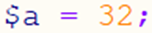
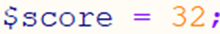
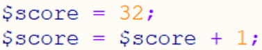
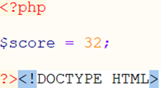
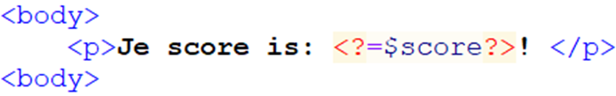

# 2.1: De basis van PHP: variabelen

*Onderdeel van: 2: Variabelen gebruiken in PHP*

---

Om een PHP-bestand overzichtelijk te houden, beginnen we
altijd met de PHP-code. Het is mogelijk om PHP en HTML door elkaar te
gebruiken, maar daardoor zal je code al snel een rommeltje worden. Om dat te
voorkomen, delen we een PHP-bestand op in twee delen: een PHP-deel en een
HTML-deel. Het PHP-deel staat tussen <?php en ?> en het HTML-deel staat tussen
de al bekende html-tags. Daartussen staat het documenttype vermeld. Kijk maar
eens in het (verder lege) startbestand.php.

Alles wat in het PHP-gedeelte staat, wordt uitgevoerd door
de server. Alles wat daarbuiten staat wordt precies zo naar de gebruiker
opgestuurd. Omdat we de pagina wel willen aanpassen, moeten we dus toch kleine
stukjes PHP in de HTML-code plaatsen. Voor zulke aanpassingen gebruik je
variabelen. Een **variabele** is een manier om een waarde in het geheugen van de
server te zetten. Je geeft die geheugenplek een naam. Die moet duidelijk zijn,
zodat iedereen die je code leest, begrijpt wat er gebeurt. Als je bijvoorbeeld
in het geheugen wilt zetten dat de score 32 is, dan kan je dat op verschillende
manieren doen:

 of 

De tweede manier is natuurlijk veel duidelijker. Zoals je
ziet, begint een variabele altijd met een $-teken in PHP. Dat is een regel waar
je misschien wel even aan moet wennen. Later zal je ontdekken waarom dat ook
wel handig kan zijn.

Het aanmaken van een variabele noem je **declareren**. Dat doe je in het PHP-gedeelte. Als je de waarde van
een variabele later wijzigt, noem je dat **toewijzen**.
Dat ziet er precies hetzelfde uit als een declaratie (in PHP in ieder geval, in
veel andere talen niet). Als je de waarde verderop weer gebruikt, noem je dat **opvragen**. Dat doe je in ieder geval in
het HTML-gedeelte, zodat je de opgeslagen waarde kan invullen door het weer uit
het geheugen te laden. In de onderstaande code zie je al deze drie dingen
gebeuren:

De eerste regel is de **declaratie**.
De eerste **toewijzing** in een bestand
is altijd de declaratie.

Op de tweede regel zie je weer een toewijzing. Die regel
begint hetzelfde als de declaratie. Zo ziet een toewijzing er altijd uit: de
variabele met een =-teken erachter. De opdracht is dat de score één hoger moet
worden (de score wordt nu dus 33). Daarvoor moet eerst de waarde **opgevraagd** worden uit het geheugen. Daarbij
wordt 1 opgeteld. Die waarde wordt **toegewezen**
aan de variabele score. Kijk hier een paar keer goed naar, zodat je het echt
begrijpt. Dit is heel belangrijk voordat je verder gaat.

Om het HTML-deel overzichtelijk te houden, wil je daar zo
min mogelijk PHP-code in zetten. Daarom vul je het liefste alleen de naam van
een variabele in, die je in het PHP-deel een waarde hebt gegeven. Dat ziet er
als volgt uit. In het PHP-deel zet je bijvoorbeeld dat je score 32 is:

In het HTML-deel kan je dat weer invullen:

De complete code staat in score.php. Kijk daar maar eens en
probeer wat aan te passen (bijvoorbeeld een toewijzing om de score één te
verhogen).

Even op een rijtje:

- Een variabele in PHP begint altijd met een
  $-teken.
- Een declaratie ziet er hetzelfde uit als een
  toewijzing.
- De meeste code staat in het PHP-deel, dus tussen
  <?php en ?>.
- De waarde van een variabele in het HTML-deel
  invullen doe je door de variabele tussen <?= en ?> te zetten.

---

[← Terug naar inhoudsopgave](index.md)
