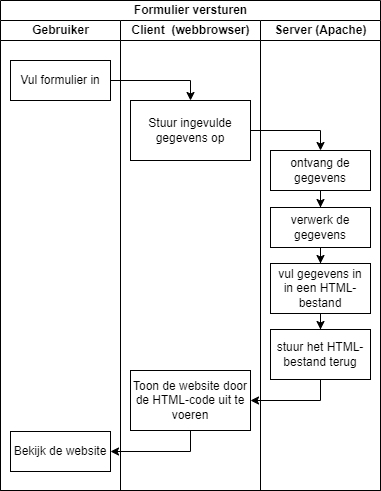
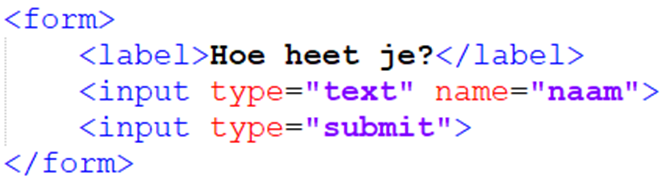
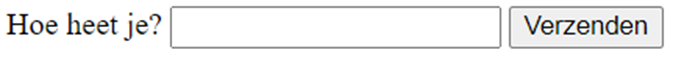
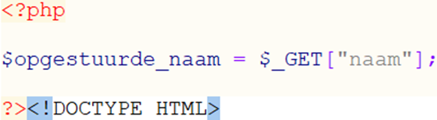
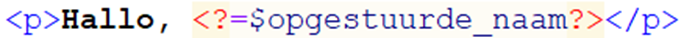
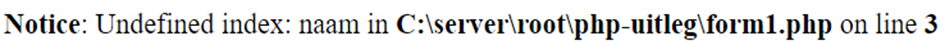
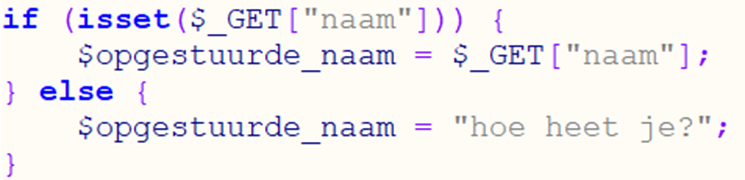
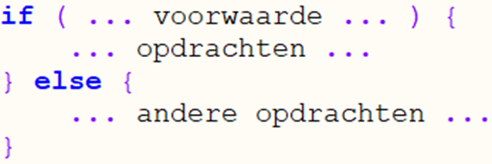

# 3.1: Formulieren opsturen

*Onderdeel van: 3: Formulieren verwerken met PHP*

---

Je kan PHP-code goed gebruiken om gegevens die een gebruiker opstuurt te verwerken in je website. Dat is bijvoorbeeld nodig bij inloggen. Rechts zie je de acties die daarvoor nodig zijn van de gebruiker, de client en de server. Om dit mogelijk te maken, moet je als programmeur vier stukjes code maken:

1.      Een formulier waarin de gebruiker gegevens kan invoeren (HTML)

2.      Een stukje code dat de gegevens ontvangt die opgestuurd worden (PHP).

3.      Een stukje code dat de gegevens verwerkt, bijvoorbeeld: controleren of het wachtwoord klopt (PHP).

4.      Een stukje code dat het resultaat aan de gebruiker laat zien, (bijvoorbeeld dat het inloggen gelukt is, of dat het wachtwoord niet klopte (PHP in het HTML-deel).

Deze vier onderdelen werken als volgt:

### Formulier opsturen

Een formulier maak je in HTML. Een **formulier** bestaat uit labels en inputs, die allemaal in een form-element staan. De **inputs** zijn het belangrijkste, omdat de gebruiker daarin iets kan invoeren. De **labels** zijn ook wel handig, want dat is de tekst die erbij staat om aan te geven wat de gebruiker moet invullen in de verschillende inputs. Een simpel formulier ziet er bijvoorbeeld zo uit:

In je browser ziet dat er zo uit:

Open het bestand “form1.html” en test het zelf maar eens. Verzend je naam en kijk wat er gebeurt met de URL in de adresbalk van je browser.

In de code zie je dat de inputs allebei minimaal één **attribuut** hebben: `type="…"`. Dat is verplicht bij een input, omdat het aangeeft wat je ermee kan: tekst invoeren, het formulier opsturen, een vinkje aanzetten, enzovoorts. Op W3Schools kan je alle opties vinden.

Het **name-attribuut** is niet verplicht, maar die heb je wel altijd nodig behalve bij de submit-knop. Je hebt vast al gezien dat de “name” die hier is ingevoerd in de URL terug kwam toen je het formulier verstuurde: form1.html?naam=Paulus. Daar moeten we nog iets mee doen…

### Gegevens ontvangen

Je hebt nu gezien hoe de gegevens opgestuurd worden. Nu moet je daar nog iets mee doen: die gegevens kan je bijvoorbeeld invullen in de webpagina. Om dat te doen, maak je een stukje PHP-code aan het begin van je bestand. Daar kan je de gegevens uit de URL in een variabele zetten. Dat betekent dat je ze in het geheugen van de servercomputer zet. Het stukje geheugen waar het in staat, geef je een naam. Dat doe je als volgt:

Met die regel PHP-code declareer je een variabele “opgestuurde\_naam”.
Die haalt zijn waarde uit de URL. Dat schrijf je in PHP als
$\_GET["…"]. Op de puntjes zet je wat het name-attribuut van de input
is. In dit geval was het “naam”:

Als je de opgestuurde waarde in het geheugen van de server
hebt geladen, kan je er iets mee doen. Dat noemen we “**verwerken**”.

### Gegevens verwerken

Je kan opgestuurde gegevens bijvoorbeeld controleren: klopt
het wachtwoord wel? In dit geval lijkt dat niet nodig. Er wordt namelijk alleen
maar een naam opgestuurd. Daarom slaan we deze stap nu even over, om het
makkelijk te houden. Straks zal je zien dat er toch wel een verwerkings-stap
gedaan moet worden.

### Resultaat weergeven

Als laatste willen we het resultaat ergens in de HTML-code laten zien. Laten we dat in een alinea boven het formulier zetten:

Probeer maar eens uit hoe het werkt met bestand “[form1.php](../oefenen/onderwerp-3/form1.php)”. Let op dat je het wel in je hoofdmap zet en de server draait (`start-server`). Probeer het .PHP-bestand maar eens in je browser te openen zonder USBWebserver, dan zie je wat ik bedoel.

Als je het in de root-map hebt gezet, typ `start-server` in de terminal en open [form1.php](../oefenen/onderwerp-3/form1.php) in de browser. Daar zie je nu een foutmelding:

Waar komt dat door? Omdat er nog niets opgestuurd is, dus
`$\_GET["naam"]` heeft geen waarde! Zoals je in de foutmelding ziet,
wordt “naam” de **index** genoemd. Dat betekent: "de plek waar je iets kan vinden". In dit geval zoekt PHP namelijk naar een waarde die is opgestuurd met een formulier en die dus te vinden is in de URL, bijvoorbeeld [form1.php](../oefenen/onderwerp-3/form1.php)?naam=Paulus. In dit voorbeeld kan je zeggen: de waarde "Paulus" is opgestuurd met index "naam". Als je nog niets hebt opgestuurd, is de waarde op index "naam" nog onbekend, oftewel **undefined** (niet
gedefinieerd). In de foutmelding staat dat het mis gaat op regel 3 in de code. Daar moet je dus nog iets aanpassen. Hieronder vindt je uitleg over de oplossing van dit probleem. Nu is het vooral belangrijk dat je ziet hoeveel informatie er in een foutmelding staat. Een **foutmelding** geeft je alle informatie die je helpt om te ontdekken
wat er mis gaat. De oplossing staat er natuurlijk niet bij, die moet je zelf bedenken of opzoeken.

### Gegevens verwerken als ze niet altijd worden opgestuurd

Gelukkig is het probleem makkelijk op te lossen: we moeten
in de PHP-code de opdracht geven om eerst te controleren of er wel een naam is
opgestuurd. Dat kan je doen met de volgende code:

Hiermee stel je een voorwaarde: Als er een waarde in
de URL staat met index “naam”, dan moet je bepaalde dingen doen, en anders moet je iets anders doen.
De vorm om een **voorwaarde te stellen** is altijd hetzelfde:

Let goed op alle haakjes! Tussen de ronde haken staat de voorwaarde, en tussen de krulhaken staan de opdrachten die uitgevoerd moeten worden.

Test het maar eens met [form1v2.php](../oefenen/onderwerp-3/form1v2.php).

---

Maak nu de volgende opdrachten:

- [Opdracht 3.1.1: Kleur kiezen](opdrachten/opdr-3-1-1.md)
- [Opdracht 3.1.2: Registreren I](opdrachten/opdr-3-1-2.md)

[← 2.1: Variabelen](2-1-variabelen.md) | [4.1: Gegevens opslaan →](4-1-gegevens-opslaan.md)

[← Terug naar inhoudsopgave](index.md)
