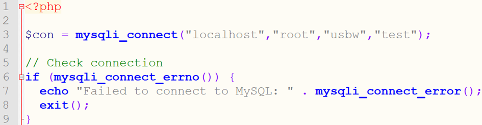
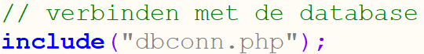
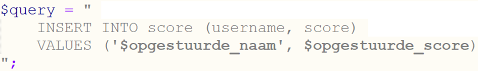
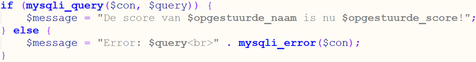
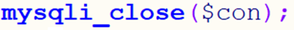

# 4.2: Gegevens invoeren

*Onderdeel van: 4: Gegevens in een database opslaan*

---

Gegevens die in de database komen, moeten door de gebruiker
ingevoerd worden. Daarvoor moet je dus een formulier gebruiken. Het formulier wordt opgestuurd naar de webserver (die PHP-code kan uitvoeren). Die server moet de gegevens vervolgens doorsturen naar de database-server. Daarvoor gebruik je een query, die je schrijft in de taal **SQL**. In het onderstaande schema zie je de drie programma's die dus nodig zijn om gegevens van een gebruiker op te slaan in een database:  

Je ziet dat het webserver-programma nu ook een client is. De webserver doet namelijk een aanvraag bij de database-server, en dus is hij client ten opzichte van de database-server.

We gaan nu als voorbeeld bekijken hoe je de score van een
gebruiker kan opslaan in de database. Hiervoor moet je eerst een tabel maken waarin de gegevens opgeslagen zullen worden. Maak een tabel aan met als naam **scores** en met de volgende eigenschappen:

|  |  |  |
| --- | --- | --- |
| **Kolomnaam** | **Type** | **Sleutel** |
| username | varchar(20) | primaire sleutel |
| score | int |  |

Uitleg: varchar(20) betekent dat de lengte van de varchar 20
is.  
Tip: deze tabel kan je aanmaken in een test-database. Die noem je gewoon “oefenen”.

De volgende stap is om een formulier te maken waarin een
gebruiker de gegevens kan invoeren. Deze staat al voor je klaar in
[form\_score.php](../oefenen/onderwerp-4/form_score.php).

Eerder liet je opgestuurde gegevens invullen in het
HTML-deel. Dat ga je nu niet doen. Nu moet het juist naar een andere server
opgestuurd worden, namelijk naar de database-server. Daar moeten we twee dingen voor
doen:

1. Verbinding maken met de database-server door
   erop in te loggen.
2. Een query maken met de gegevens die opgeslagen moeten worden.
3. De query opsturen.
4. Verbinding verbreken met de database-server

**Verbinding maken**

Als je een website maakt, zal je op veel pagina’s gebruik willen
maken van de database. Soms is dat om gegevens op te slaan, maar vaker nog om
gegevens op te halen. Op al die pagina’s moet je verbinding maken met de
database. Daarom is het handig om er een apart bestandje voor aan te maken, dat
je dan makkelijk kan invoegen met het include-commando. Dat bestand wordt vaak
[dbconn.php](../oefenen/onderwerp-4/dbconn.php) genoemd (database connection). Daarin zet je de volgende code. De
uitleg ervan staat eronder.

Op regel 1 geef je aan dat het een stukje php-code is.

Op regel 3 maak je verbinding met de database-server. De verbinding
wordt opgeslagen in een variabele, die hier de naam “$con” krijgt. Daarachter
staat het commando “mysqli\_connect”. Dat is een commando dat vier gegevens nodig
heeft, die je tussen ronde haken erachter opgeeft:

1. De naam van de servercomputer waar het database-serverprogramma
   op aan staat.
2. De gebruikersnaam om in te loggen bij de database.
3. Het wachtwoord om in te loggen bij de database.
4. De naam van de database die je wilt gebruiken.
   In dit voorbeeld gaan we ervan uit dat jij die “test” hebt genoemd.

In [de reference op
w3-schools](https://www.w3schools.com/Php/func_mysqli_connect.asp) kan je hier meer uitleg over vinden. We gebruiken bij deze cursus
de “procedural style”, daar moet je op letten als je voorbeeldcodes zoekt. Je
kan die stijl herkennen aan “mysqli\_” aan het begin van alle database-commando’s.

Op regel 6-9 staat een stukje code dat kijkt of er geen fout
is opgetreden bij het maken van de verbinding. Dit zorgt ervoor dat je ten
minste te zien krijgt als het opgegeven wachtwoord bijvoorbeeld niet klopt. De
bedoeling van dit stukje code staat ook al als commentaar op regel 5. Dat is
een goede gewoonte om zelf ook te doen: **zet
commentaar als uitleggende tussenkopjes in je code**.

Als er geen HTML-deel in een bestand staat (zoals nu), dan hoef
je het PHP-deel ook niet af te sluiten met .

Nu moet je nog zorgen dat deze code wordt uitgevoerd in je PHP-bestand. Daarvoor zet je bovenaan de volgende regel code neer:  

**Query opsturen**

Als je zo verbinding hebt gemaakt, kan je via de opgeslagen
verbinding ($con) query’s versturen naar het DBMS. Hoe je dit kan doen, kan je
ook weer vinden [in
de reference op w3schools](https://www.w3schools.com/Php/func_mysqli_query.asp). Een uitgebreidere uitleg staat in de [PHP-tutorial van w3schools](https://www.w3schools.com/php/php_mysql_insert.asp).

Laten we eerst de query zelf bekijken, en daarna hoe die
opgestuurd wordt via de verbinding.

De query maak je zoals hieronder staat.

Dit is een stukje **tekst**die je opslaat in een variabele. Dat zie je aan de aanhalingstekens er omheen: " aan het begin en einde. Tussen zulke aanhalingstekens kan je in PHP een variabele neerzetten. Dat herkent de PHP-server omdat een variabele altijd moet beginnen met het $-teken. Op die plek zal de PHP-server dus de waarde van de variabele invullen.

De query is een opdracht voor de SQL-server (MySQL). De betekenis van deze query is als volgt:  
**INSERT INTO** geeft aan dat er gegevens ingevoegd moeten worden in een tabel in de database.  
Daarachter staat de naam van de tabel. Hier is dat score.  
Daarachter staan de kolommen die een waarde krijgen, hier dus username en score.  
Achter **VALUES** zet je de waarden die in de tabel ingevoegd moeten worden. In dit geval zijn dat de opgestuurde naam en de opgestuurde score.  
**Let op** dat je variabelen die een stukje tekst zijn, tussen **'aanhalingstekens'** moet zetten! De tweede waarde is een getal, dus die hoeft niet tussen aanhalingstekens te staan.

Wil je weten hoe deze query eruit ziet? Voeg dan even de volgende regel toe:  
print($query);  
Test het bestand via [form\_score.php](../oefenen/onderwerp-4/form_score.php)

Om de query uit te voeren, gebruik je de volgende code.

Hierin zie je dat er gelijk een variabele wordt ingesteld om
een melding te geven of het gelukt is of niet. Daarvoor is de if nodig, die om het
`mysqli_query`-commando heen staat. Dat commando heeft twee gegevens nodig, namelijk
de verbinding (`$con`) en de query (`$query`).

**Verbinding verbreken**

Tot slot sluit je de verbinding weer. Dat scheelt weer geheugengebruik
op de database-server.

Zet stukjes code op de juiste plaats in [form\_score.php](../oefenen/onderwerp-4/form_score.php) en test of het werkt. Als
je er niet uitkomt, kan je kijken bij [uitwerking\_form\_score.php](../oefenen/onderwerp-4/uitwerking_form_score.php).

---

Maak nu [opdracht 4.2: Registreren II](opdrachten/opdr-4-2.md).

[← 4.1: Gegevens opslaan](4-1-gegevens-opslaan.md) | [5.1: Gegevens ophalen →](5-1-gegevens-ophalen.md)

[← Terug naar inhoudsopgave](index.md)
