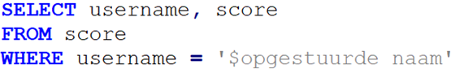
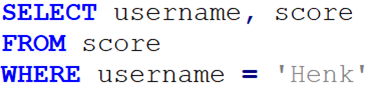
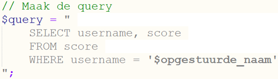
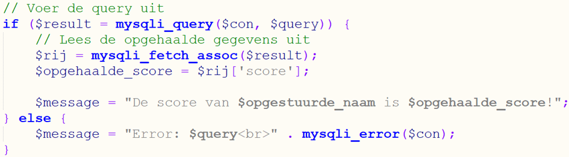
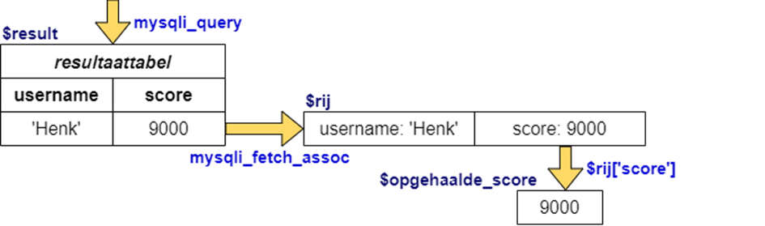
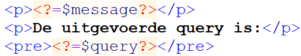

# 5.1: Gegevens ophalen

*Onderdeel van: 5: Gegevens uit een database ophalen*

---

Om gegevens weer uit een database op te vragen, werk je volgens
hetzelfde principe. Het belangrijkste verschil is dat je nu soms ook meerdere rijen
kan terug krijgen van de database-server, die je allemaal wilt weergeven. Laten we eerst
maar even kijken naar een voorbeeld waarbij je één rij uit de database krijgt
als resultaat.

Je gaat nu de score printen van een gebruiker. Daarvoor moet
een gebruikersnaam opgestuurd worden via een formulier. Dat formulier staat al
klaar in form\_score\_opvragen.php. Open het bestand en voer de volgende stappen
uit om het werkend te krijgen. Dat is weer net als bij het invoeren, met stap 4
als extra tussenstap:

1. Verbinding maken met de database-server door erop in te loggen.
2. De query maken, met ingevulde waarden.
3. De query opsturen naar de database-server.
4. Het resultaat verwerken in PHP.
5. De verbinding met de database-server sluiten.

De eerste stap is het maken van de query. De query begint nu
niet met INSERT INTO, maar met SELECT omdat we nu gegevens willen opvragen (“selecteren”).
In de query geef je aan welke kolommen je wilt selecteren, uit welke tabel die
komen en aan welke voorwaarde de gegevens moeten voldoen. De query ziet er dan
als volgt uit:

Ook hier wordt weer een variabele ingevuld door PHP. Als de
score van Henk opgevraagd moet worden, wordt de SQL-code die opgestuurd wordt
naar de database-server:  

Met zo’n query maak je een tabel met gegevens uit de
database. Die tabel noem je de **resultaattabel**.
Een tabel waar de gegevens uit komen, noemen we de **brontabel**.

Op iedere regel van de query staat één **codewoord**. Laten we
bekijken wat die codewoorden betekenen:   
**SELECT** geeft aan welke **kolommen** uit de brontabel moeten worden
overgenomen. In dit geval zijn dat de kolommen `username` en `score`. Je kan
hierachter ook een sterretje zetten “ \* ”, dat betekent: neem alle kolommen
over uit de brontabel.  
**FROM** geeft aan wat de **brontabel** is. score: In dit geval is de
**brontabel** `score`. Daar worden de
gegevens dus uit geselecteerd.  
**WHERE** geeft aan welke **rijen** uit de brontabel er in de
resultaattabel moeten komen. Daarvoor gebruik je een **voorwaarde**. Alle rijen die aan de voorwaarde voldoen, komen in de
resultaattabel. In dit geval is de voorwaarde “username = 'Henk' ”. In dit
voorbeeld moet in de kolom `username` de waarde 'Henk' staan. In dit geval kan dat
maar één rij zijn, omdat username de primaire sleutel is.

Ook nu wordt dit weer als tekst in een PHP-variabele gezet:  

Neem deze code over in het bestand [form\_score\_opvragen.php](../oefenen/onderwerp-5/form_score_opvragen.php).

De tweede stap is om de query op te sturen. Dat gaat nu net
iets anders, omdat je het resultaat van de query ook nodig hebt. Bij de
INSERT-query was dat niet nodig. Daar hoefde je alleen te weten of het gelukt
was. Nu heb je de gegevens nodig om die met PHP in te vullen in het HTML-deel
van je website. Daarom zet je het resultaat in een PHP-variabele. Een logische
naam daarvoor is `$result`.  

De derde stap is om het resultaat te verwerken. Hieronder
zie je een schema met de stappen die hiervoor in de code worden gedaan. Onder
het schema staat de uitleg van wat er gebeurt.  

Zie je de toevoeging van `$result =` tussen de haakjes achter
if? Dat zorgt ervoor dat het resultaat opgeslagen wordt in de variabele
`$result`. Die variabele bevat nu dus de resultaattabel. Daaruit ga je een rij
halen (dat is als het goed is de enige rij). Daarvoor gebruik je de functie `mysqli_fetch_assoc`.
Die functie heeft alleen de resultaattabel nodig om zijn werk te kunnen doen.
Die staat dus tussen de ronde haken (`$result`). Uit de rij wordt dan de score
gehaald en opgeslagen in de variabele `$opgehaalde_score`. Dat kan dus door
achter $rij de naam van de kolom tussen vierkante haken te zetten, én tussen
aanhalingstekens. De kolomnaam moet je dus als een stukje tekst tussen vierkante
haken zetten. Dat is namelijk wat aanhalingstekens “ ' ” betekenen.

De opgehaalde gegevens moeten uit eindelijk in het HTML-deel
worden ingevuld. Daarvoor wordt hier de variabele $message weer gebruikt.
Daarin wordt de opgehaalde score ingevuld. In het HTML-deel van de code wordt
$message ergens neergezet. Dat ziet er bijvoorbeeld zo uit:  

Als vierde en laatste stap moet je de verbinding met de
database-server weer sluiten natuurlijk. Dat gaat precies hetzelfde als bij het
invoeren van gegevens met de INSERT-INTO-query.

Zet stukjes code op de juiste plaats in
[form\_score\_opvragen.php](../oefenen/onderwerp-5/form_score_opvragen.php) en test of het werkt. Als je er niet uitkomt, kan je kijken
bij [uitwerking\_form\_score\_opvragen.php](../oefenen/onderwerp-5/uitwerking_form_score_opvragen.php).

---

Maak nu [opdracht 5.1: Inloggen I](opdrachten/opdr-5-1.md).

[← 4.2: Gegevens invoeren](4-2-gegevens-invoeren.md) | [5.2: Gegevens verbergen →](5-2-gegevens-verbergen.md)

[← Terug naar inhoudsopgave](index.md)
