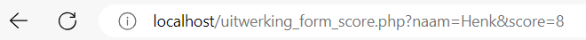
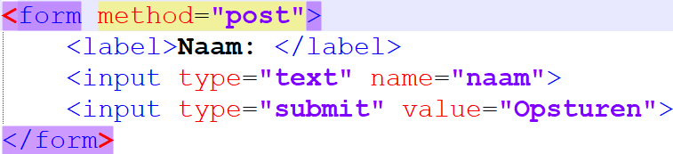
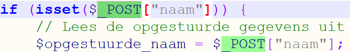
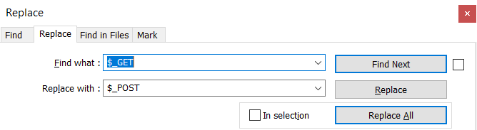

# 5.2: Opgestuurde gegevens verbergen

*Onderdeel van: 5: Gegevens uit een database ophalen*

---

Tot nu toe heb je alle gegevens van een gebruiker via een standaard formulier naar de server gestuurd. Om gegevens daaruit te ontvangen, gebruikte je $\_GET[…] in PHP. Zoals je misschien wel is opgevallen, staan alle gegevens die je opstuurt nu zichtbaar in beeld, namelijk in je adresbalk:

Dat is geen mooie manier om een wachtwoord te versturen. Gelukkig is er een alternatief, namelijk POST. Hiervoor moet je twee dingen doen:

- In HTML het formulier aanpassen.
- In PHP het ontvangen van de gegevens aanpassen.

Voer deze stappen uit in het bestand uitwerking\_form\_score.php.

In HTML moet je eerst in het form-element een attribuut toevoegen:  

Het attribuut heet “method”. Daarmee geef je aan op welke manier gegevens opgestuurd moeten worden naar de server. Als je niet aangeeft hoe je wilt dat dat gebeurt, dan wordt de get-manier gebruikt (method="get").

De gegevens worden nu op de post-manier verstuurd. Dat moet je ook in het PHP-deel aangeven, anders zoekt de server naar gegevens op de verkeerde plek. Overal waar in de code $\_GET[…] staat, moet je nu $\_POST[…] neerzetten:  

Tip: gebruik hiervoor de replace-functie (zoeken en vervangen) van Notepad++. Die kan je vinden in het menu “Search” (“Zoeken”). De sneltoets hiervoor is Ctrl + H.  

Let op dat je de zoekmodus wel op “Normaal” hebt staan:  

Test maar of het werkt!

---

[← Terug naar inhoudsopgave](index.md)
