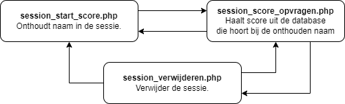
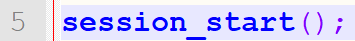
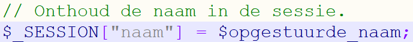

# 6.1: Cookies gebruiken

*Onderdeel van: 6: Onthouden wat er ingevoerd is*

---

Zoals je misschien al hebt ontdekt, onthoudt een PHP-server de waarde van een variabele totdat de HTML-pagina gegenereerd is. Als je de volgende keer dezelfde pagina bezoekt, dan is de PHP-server alweer vergeten wat je net nog had opgestuurd met het formulier. Om er toch voor te zorgen dat een PHP-server gegevens voor je kan onthouden, kan je gebruikmaken van cookies.

We gaan een cookie gebruiken om een **sessie** te maken. Dat betekent dat de gegevens die onthouden moeten worden niet in de cookie zelf staan, maar op de webserver (Apache). In de cookie staat alleen een unieke code. Dankzij die code weet de webserver voor wie hij de gegevens onthouden heeft. Zo’n code wordt ook wel een **token** genoemd. Dat maakt het moeilijker voor een hacker om een cookie na te maken. Als in een cookie gewoon een gebruikersnaam zou staan, dan kon een hacker makkelijk een cookie maken met je gebruikersnaam erin en zo doen alsof hij ingelogd was namens jou!

Je gaat nu een sessie gebruiken in het voorbeeld dat we steeds gebruiken: scores opslaan. Die sessie ga je gebruiken om te onthouden van welk account je de score wilt zien. Daarvoor gaan we drie bestanden gebruiken:   
session\_start\_score.php om de naam te onthouden,   
session\_score\_opvragen.php om de score te laten zien die hoort bij de naam die onthouden is via de cookie, en   
session\_verwijderen.php om de sessie te verwijderen, inclusief de cookie.  

De bestanden die we hiervoor gebruiken, lijken veel op de bestanden die we eerder gebruikten. Nu is de code over twee bestanden gedeeld, en komt er een sessie bij. In alle bestanden staan links in het HTML-gedeelte om naar de andere bestanden te gaan. In het schema zie je met de pijltjes welke links er zijn.

We gaan nu echt beginnen. Daarvoor moet je eerst een sessie starten. PHP maakt daarbij automatisch een cookie. Hiervoor geef je de volgende opdracht. Meestal zet je die helemaal bovenaan een PHP-bestand.  

Zet deze regel maar bovenaan in session\_start\_score.php, op regel 5. Voer alle andere stappen hieronder ook uit, zodat je ziet hoe het werkt.

Met deze regel wordt een sessie gestart. Dat kan twee dingen betekenen. Als er nog geen sessie bestaat, dan wordt er een nieuwe cookie aangemaakt met een token. Als er al een cookie is, wordt de sessie die daarbij hoort weer geladen.

Het bestand session\_start\_score.php heeft dezelfde opbouw die je eerder ook al zag. Als er iets opgestuurd wordt met het formulier, dan moet daar iets mee gedaan worden. In dit geval gaan we ook gegevens in de sessie opslaan.

Het opslaan van gegevens in een sessie gebeurt op een manier die lijkt op het werken met formulieren. Daar werkte je met $\_GET of $\_POST. Nu werk je met $\_SESSION. Als je een naam wilt opslaan in de sessie, dan kan je dat als volgt doen:  

Nu wordt de naam opgeslagen in de sessie als die ingevoerd wordt door de gebruiker. Het bestand ziet er als het goed is nu zo uit: uitwerking\_session\_start\_score.php.

---

[← Terug naar inhoudsopgave](index.md)
