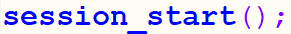
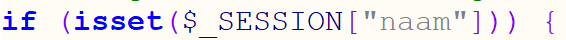
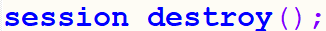

# 6.2: Gegevens uit sessie lezen

*Onderdeel van: 6: Onthouden wat er ingevoerd is*

---

Nu kan je in een ander bestand de naam uit de sessie weer ophalen. Dat gaan we nu doen in session\_score\_opvragen.php. In dit bestand hebben we verbinding nodig met de database om de score op te halen, én we hebben gegevens uit de sessie nodig. Daarom moet bovenaan dit bestand ook weer de sessie gestart worden:  

Daarna moeten we kijken of er een naam in de sessie is opgeslagen. Dat doe je weer met de isset-functie, net als bij formulieren:  
  
Nu kijk je alleen niet in $\_GET of $\_POST, maar in $\_SESSION.

Vul nu de rest van de PHP-code binnen de if-constructie in zoals je dat eerder ook hebt gedaan bij form\_score\_opvragen.php (zie uitwerking\_form\_score\_opvragen.php). Pas de variabelen aan, zodat je niet werkt met $opgestuurde\_naam, maar met $opgeslagen\_naam.

Hoe het er nu uit moet zien, kan je ook vinden in uitwerking\_session\_score\_opvragen.php.

Als je een sessie weer wilt verwijderen, dan kan je daarvoor de volgende functie gebruiken:  
  
Hiervoor moet je wel eerst een sessie gestart hebben, anders is er niets om te verwijderen. Er is al een bestand waarin je kan zien hoe dit werkt: session\_verwijderen.php.

---

[← Terug naar inhoudsopgave](index.md)
