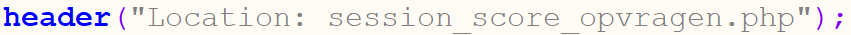

# 6.3: Automatisch doorverwijzen

*Onderdeel van: 6: Onthouden wat er ingevoerd is*

---

Het is eigenlijk wel handiger als je niet steeds handmatig op de links moet klikken. Daar gaan we nu iets aan doen: we laten PHP automatisch doorverwijzen naar de volgende pagina. Dat gaan we doen als de gebruiker een naam heeft ingevoerd. Dan moet hij automatisch naar session\_score\_opvragen.php gaan.

Hiervoor gebruik je de header-functie van PHP. Dat ziet er zo uit:  

Voeg deze regel maar toe aan session\_start\_score.php, als er een naam is opgeslagen in de sessie. Doe dat vlak voor de regel met “} else {”. Zie uitwerking\_session\_start\_score\_doorverwijzen.php voor de uitwerking.

---

[← Terug naar inhoudsopgave](index.md)
