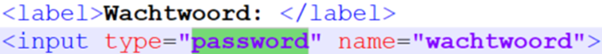
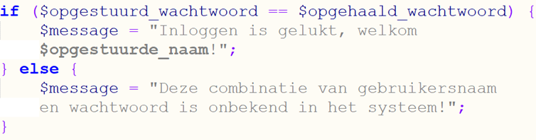

# Opdr. 5.1: Inloggen I

*Onderdeel van: 5: Gegevens uit een database ophalen*

---

Maak een PHP-bestand in de hoofdmap, en noem het inloggen.php.
Gebruik [oefenen/startbestand.php](../../oefenen/startbestand.php) als basis.

1. Zet in het HTML-deel een
   registratieformulier met velden voor een gebruikersnaam en wachtwoord. Zorg
   ervoor dat anderen het wachtwoord niet mee kunnen lezen. Dat kan je doen door een
   input van type “password” in het formulier te zetten:  
   
2. Vraag in het PHP-deel het wachtwoord op. Doe dat op dezelfde
   manier dat je de score op hebt gevraagd (zie [uitwerking\_form\_score\_opvragen.php](../../oefenen/onderwerp-5/uitwerking_form_score_opvragen.php)).
3. Het belangrijkste verschil is dat je het wachtwoord natuurlijk niet in een melding
   wilt tonen. Om te controleren of het wachtwoord klopt, kan je de volgende code
   gebruiken:  
     
   In deze voorbeeldcode wordt je automatisch doorverwezen naar ingelogd.php. Als jouw bestand anders heet, moet je dat hier dus wel even aanpassen (bijvoorbeeld dashboard.php of home.php).

